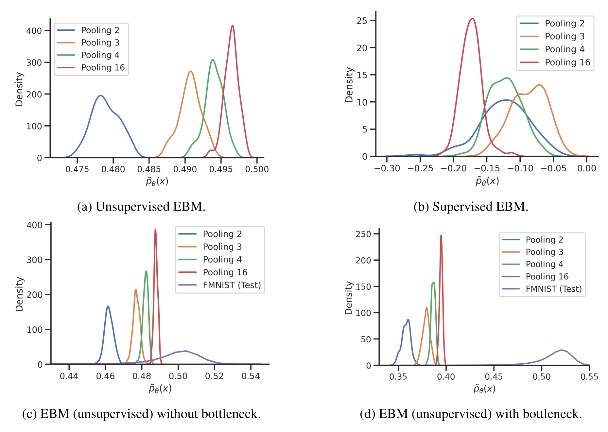

# On Out-of-distribution Detection with Energy-based Models

This repository contains the code for the experiments conducted in the paper

> [On Out-of-distribution Detection with Energy-based Models](https://arxiv.org/abs/2107.08785) \
Sven Elflein, Bertrand Charpentier, Daniel Zügner, Stephan Günnemann \
ICML 2021, Workshop on Uncertainty & Robustness in Deep Learning.


<p align="center">
  
</p>


## Setup

```
conda create --name env --file req.txt
conda activate env
pip install git+https://github.com/selflein/nn_uncertainty_eval
```

## Training & Evaluation

In order to train a model use the respective combination of configurations for dataset and model, e.g.,

```
python uncertainty_est/train.py fixed.output_folder=./path/to/output/folder dataset=sensorless model=fc_mcmc
```

to train a EBM with MCMC on the Sensorless dataset. See `configs/model` for all model configurations.

In order to evaluate models use

```
python uncertainty_est/evaluate.py --checkpoint-dir ./path/to/directory/with/models --output-folder ./path/to/output/folder
```

This script generates CSVs with the respective OOD metrics.

## Cite

If you find our work helpful, please consider citing our paper in your own work.

```
@misc{elflein2021outofdistribution,
      title={On Out-of-distribution Detection with Energy-based Models},
      author={Sven Elflein and Bertrand Charpentier and Daniel Zügner and Stephan Günnemann},
      year={2021},
      eprint={2107.08785},
      archivePrefix={arXiv},
      primaryClass={cs.LG}
}
```

## Acknowledgements

* RealNVP from https://github.com/chrischute/real-nvp
* Glow from https://github.com/chrischute/glow
* JEM from https://github.com/wgrathwohl/JEM
* VERA from https://github.com/wgrathwohl/VERA
* SSM from https://github.com/ermongroup/sliced_score_matching
* WideResNet from https://github.com/meliketoy/wide-resnet.pytorch
